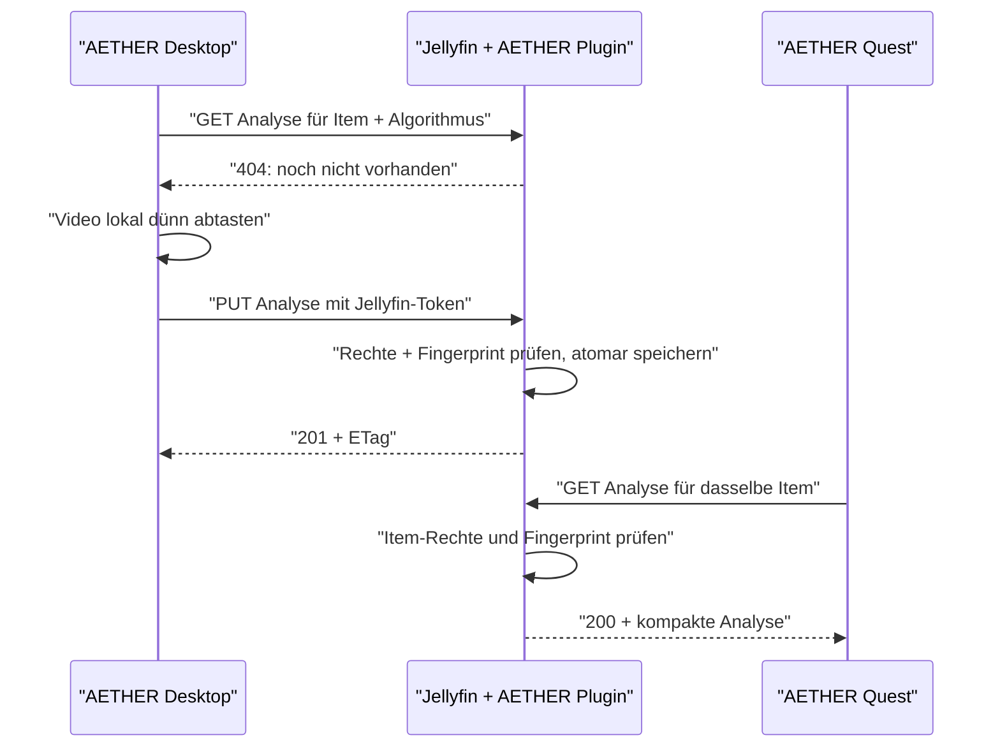
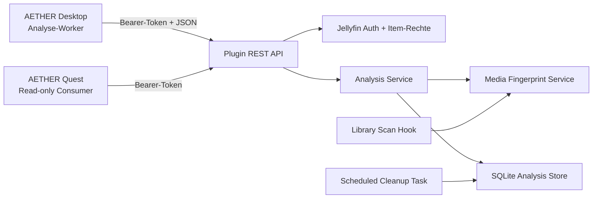

# AETHER Analysis Plugin für Jellyfin – technisches Konzept

**Status:** Angenommen; normative Architekturgrundlage

**Dokumentversion:** 1.0

**Datum:** 2026-07-16

**Zielsystem:** Jellyfin 10.11.11 mit AETHER Desktop/Web und Meta Quest als Clients

## 1. Zweck dieses Dokuments

Dieses Dokument beschreibt die verbindliche Umsetzung eines Jellyfin-Plugins, das vorab erzeugte
AETHER-Videoanalysen einem Jellyfin-Medieneintrag zuordnet, persistent speichert, autorisiert an
Clients ausliefert und verwaltet.

Es dokumentiert insbesondere folgende projektübergreifend verbindliche Entscheidungen:

- Verantwortungsgrenze zwischen AETHER-Client und Jellyfin-Plugin
- REST-API und Autorisierungsmodell
- Struktur, Validierung und Versionierung der JSON-Daten
- Dateibezogene Zuordnung und Invalidierung nach Medienänderungen
- Persistenz, Kompression, Speicherlimit und Bereinigung
- Synchronisierung mehrerer AETHER-Projekte auf einen gemeinsamen Plugin-Vertrag
- optionale Migration bestehender Sidecar-Daten außerhalb des Plugin-Kerns

## 2. Kurzfassung der Idee

Der AETHER-Desktop analysiert ein Jellyfin-Video zunächst weiterhin clientseitig. Er decodiert
standardmäßig vier niedrig aufgelöste Bilder pro Sekunde bei 480 Pixeln Breite und erzeugt daraus
ausschließlich
kompakte Merkmale wie Helligkeit, Kontrast, Sättigung, Bewegung, Szenenwechsel und Farbpalette.

Das Jellyfin-Plugin nimmt diese Analyse entgegen und verknüpft sie serverseitig mit:

- der Jellyfin-Item-ID,
- der konkreten Media-Source,
- einem serverseitig erzeugten Medien-Fingerprint und
- der verwendeten AETHER-Algorithmusversion.

Ein Quest-Client kann dieselbe Analyse anschließend über seine bestehende Jellyfin-Sitzung laden.
Das Plugin speichert keine Videoframes, Thumbnails, Audioinhalte oder Zugangstokens.



## 3. Ziele und Nicht-Ziele

### 3.1 Ziele

- Eine Analyse wird eindeutig einem Jellyfin-Medieneintrag zugeordnet.
- Desktop und Quest verwenden dieselben Daten ohne erneute Analyse.
- Ein Benutzer kann nur Analysen von Medien lesen, auf die er in Jellyfin Zugriff hat.
- Upload, Überschreiben und Löschen sind restriktiver als Lesen.
- Eine ersetzte oder veränderte Mediendatei macht die alte Analyse automatisch ungültig.
- API und JSON-Schema sind unabhängig voneinander versionierbar.
- Speicherverbrauch bleibt durch Limit, Kompression und Bereinigung begrenzt.
- Mehrere AETHER-Projekte verwenden denselben maschinenlesbaren Vertrag.
- Bestehende Sidecar-Daten dieses Projekts können über ein separates Werkzeug importiert werden.
- Der AETHER-Client bleibt über ein Repository-Interface vom Speicherort entkoppelt.

### 3.2 Nicht-Ziele der ersten Plugin-Version

- Kein Speichern analysierter Videobilder oder Audioauszüge
- Keine Veränderung der Originalmediendatei
- Keine JSON-Sidecar-Datei neben dem Film
- Keine automatische Vollanalyse der kompletten Jellyfin-Bibliothek
- Keine parallele Massendecodierung durch den Jellyfin-Server
- Keine Veränderung des Jellyfin-Webclients selbst
- Keine öffentliche, anonyme Analyse-API

## 4. Grundlegende Architekturentscheidungen

### 4.1 Das Plugin ist Speicher- und Verwaltungsdienst

Die erste Version führt die eigentliche Bildanalyse nicht auf dem Jellyfin-Server aus. Der
Desktop bleibt der Analyse-Worker. Damit wird vermieden, dass der Server mit FFmpeg jedes Video
zusätzlich decodieren muss.

Serverseitiges Decoding und eine Plugin-eigene Job-Engine sind dauerhaft nicht Teil dieses
Plugins. Falls später ein separater Worker gewünscht wird, verhält er sich als AETHER-Client und
verwendet ausschließlich dieselbe öffentliche API.

### 4.2 Gemeinsamer Plugin-Vertrag für parallele Projekte

Das Plugin darf weder von der Sidecar-Implementierung dieses Projekts noch vom PRE-Stand des
Parallelprojekts abhängen. Es definiert den kanonischen Vertrag, gegen den beide Projekte ihre
Repository-Adapter implementieren.

Verbindlich gemeinsam versioniert werden:

- OpenAPI-Beschreibung der Plugin-Endpunkte,
- JSON Schema der Analyse-Dokumente,
- Golden Files für gültige und ungültige Payloads,
- Algorithmus-ID und Algorithmusversion,
- Fehlercodes und Capabilities sowie
- ein semantisches Änderungsprotokoll.

Diese Artefakte sollen im Plugin-Projekt die Source of Truth sein. Beide AETHER-Projekte prüfen
sie in CI und dürfen keine unabhängig abweichenden Kopien des Vertrags pflegen.

Das Parallelprojekt integriert das Plugin direkt. Der vorhandene Sidecar dieses Projekts bleibt
ein Übergangsadapter. Ein Importer ist optionales externes Migrationswerkzeug und keine
Laufzeitabhängigkeit des Plugins.

Da dieses Projekt bereits ein anderes `schemaVersion: 1`-Format verwendet, beginnt der gemeinsame
Plugin-Vertrag bewusst mit `schemaVersion: 2`. Das Parallelprojekt implementiert direkt Version 2.

### 4.3 Jellyfin-Item-ID und Media-Source statt zusammengesetztem `mediaKey`

Der aktuelle Sidecar verwendet einen Schlüssel in der Form:

```text
jellyfin:<server-url>:<item-id>
```

Innerhalb eines Jellyfin-Plugins ist der Server bereits eindeutig. Der vorgeschlagene
Plugin-Vertrag verwendet deshalb Jellyfin-Item-ID und Media-Source-ID als URL-Identität. Das
vermeidet:

- redundante Server-URLs in jedem Datensatz,
- Probleme durch geänderte Reverse-Proxy-Adressen,
- uneindeutiges Parsen von Doppelpunkten und
- versehentliche Speicherung sensitiver URL-Bestandteile.

### 4.4 Dateibezogen, aber nicht neben der Datei gespeichert

„Dateibezogen“ bedeutet logisch und über einen Fingerprint abgesichert. Die Daten liegen in einer
plugin-eigenen SQLite-Datenbank im Jellyfin-Datenverzeichnis. Eine Datei direkt neben dem Film
wird nicht empfohlen, weil Medienverzeichnisse schreibgeschützt sein können und solche Dateien
Backup-, Scan- und Berechtigungsprobleme erzeugen.

### 4.5 Analyse als komprimierter Dokument-Blob

Eine komplette Timeline wird fast immer als Ganzes gelesen. Daher wird die Analyse als
validiertes und komprimiertes JSON-Dokument gespeichert, nicht als eine SQL-Zeile pro Sekunde.

Vorteile:

- deutlich weniger SQL-Zeilen und Indizes,
- atomare Ersetzung eines vollständigen Ergebnisses,
- einfache Schema-Migration und
- direkte HTTP-Auslieferung.

Metadaten, Status und Fingerprint bleiben separat indiziert.

### 4.6 Eine Master-Analyse, mehrere Detailstufen

Das Plugin speichert eine möglichst genaue, innerhalb der Vertragslimits liegende Master-Analyse.
Clients laden nicht zwingend deren volle zeitliche Auflösung, sondern fordern eine deterministisch
abgeleitete Repräsentation an:

- `compact`: höchstens 1 Sample pro Sekunde für Quest und knappe Geräte,
- `balanced`: höchstens 4 Samples pro Sekunde als Standard und
- `full`: die hochgeladene Master-Tiefe, ohne künstlich erfundene Zwischenwerte.

Kontinuierliche Rohfeatures werden pro Zeitfenster gemittelt. Für `sceneCutProbability` bleibt das
Maximum erhalten, damit kurze Schnitte nicht verschwinden. Farben werden in quantisierten
RGB-Zellen nach Coverage zusammengeführt und auf fünf normalisierte Einträge begrenzt. Jede
Repräsentation hat ein eigenes ETag. Die vollständige Reduktionsregel steht normativ in ADR 0003.

## 5. Komponenten



### 5.1 Vorgeschlagene Plugin-Projektstruktur

```text
Jellyfin.Plugin.AetherAnalysis/
├── Api/
│   ├── AnalysisController.cs
│   ├── AnalysisQueryController.cs
│   ├── StatusController.cs
│   └── ProblemDetailsFactory.cs
├── Application/
│   ├── AnalysisService.cs
│   ├── AuthorizationService.cs
│   ├── FingerprintService.cs
│   └── RetentionService.cs
├── Configuration/
│   ├── PluginConfiguration.cs
│   └── configPage.html
├── Contracts/
│   ├── AnalysisDocumentV2.cs
│   ├── AnalysisFrameV2.cs
│   ├── BatchStatusContracts.cs
│   ├── CapabilitiesContract.cs
│   └── JsonValidation.cs
├── Infrastructure/
│   ├── AnalysisDatabase.cs
│   ├── AnalysisRepository.cs
│   ├── CompressionCodec.cs
│   └── SchemaMigrations/
├── Tasks/
│   └── CleanupAnalysisTask.cs
├── Plugin.cs
└── ServiceRegistrator.cs
```

Die konkrete Benennung ist nicht bindend. Wichtig ist die Trennung von HTTP-Vertrag,
Anwendungslogik, Jellyfin-Integration und Persistenz.

Optionale Migrationstools liegen außerhalb dieses Plugin-Kerns, beispielsweise unter
`tools/aether-analysis-import/`.

## 6. Authentifizierung und Autorisierung

### 6.1 Authentifizierung

Clients senden den bereits vorhandenen Jellyfin-Zugriffstoken ausschließlich als Header. Der
Token darf nicht in Query-Parametern, Logs, Datenbankfeldern oder Fehlerantworten erscheinen.

```http
Authorization: MediaBrowser Token="<jellyfin-access-token>"
```

Falls der konkrete Jellyfin-Controller standardmäßig ein anderes unterstütztes Headerformat
erwartet, folgt das Plugin dem nativen Jellyfin-Verhalten. AETHER kapselt dies im Repository.

### 6.2 Rechte je Operation

| Operation                    | Vorgeschlagene Berechtigung                                                |
| ---------------------------- | -------------------------------------------------------------------------- |
| Capabilities lesen           | authentifizierter Jellyfin-Benutzer                                        |
| Einzelstatus lesen           | Benutzer darf das Jellyfin-Item sehen                                      |
| Analyse lesen                | Benutzer darf das Jellyfin-Item sehen                                      |
| Analyse hochladen            | Administrator oder explizit erlaubter „Analyzer“-Benutzer                  |
| Analyse überschreiben        | wie Upload; zusätzlich Konflikt-/Fingerprint-Prüfung                       |
| Analyse löschen              | Administrator                                                              |
| Batchstatus                  | nur Ergebnisse für zugängliche Items; unzugängliche IDs nicht offenlegen   |
| Batchlöschung                | Administrator                                                              |
| Speicherstatus vollständig   | Administrator                                                              |
| Speicherstatus eingeschränkt | authentifizierter Benutzer, ohne Pfade oder administrative Konfigurationen |

### 6.3 Konfigurierbare Analyzer-Benutzer

Standardmäßig dürfen nur Administratoren Analysen schreiben. Optional enthält die
Plugin-Konfiguration eine Liste zulässiger Jellyfin-Benutzer-IDs. Damit kann ein normaler
Desktop-Benutzer analysieren, ohne allgemeine Administratorrechte zu erhalten.

### 6.4 Schutz gegen Existenz-Leaks

Für ein nicht zugängliches Item sollte die API `404` statt `403` liefern. Dadurch kann ein
Benutzer nicht anhand der Antwort unterscheiden, ob eine fremde Item-ID existiert.

## 7. API-Konventionen

### 7.1 Basisroute

```text
/AetherAnalysis/v1
```

`v1` versioniert die HTTP-Semantik. Das JSON-Dokument besitzt zusätzlich eine unabhängige
`schemaVersion`.

### 7.2 Gemeinsame Regeln

- Request und Response: `application/json; charset=utf-8`
- Fehler: `application/problem+json`
- Zeitpunkte: UTC im ISO-8601-Format
- Dauern und Timestamps: ganzzahlige Millisekunden
- IDs in Pfadsegmenten: URL-encoded
- Uploadgröße: standardmäßig maximal 50 MiB unkomprimiert
- Batchgröße: standardmäßig maximal 200 Items
- Antworten unterstützen HTTP-Kompression
- Erfolgreiche Analyseantworten liefern `ETag`
- `Cache-Control: private, no-cache`; Clients dürfen mit `If-None-Match` revalidieren
- Keine Tokens, Dateipfade oder internen Datenbankpfade in Antworten

## 8. Vorgeschlagene Endpunkte

### 8.1 Fähigkeiten und Vertrag aushandeln

```http
GET /AetherAnalysis/v1/capabilities
```

Zweck: Der Client erkennt Pluginversion, unterstützte JSON-Schemata, Limits und Schreibrechte.

Beispielantwort:

```json
{
  "apiVersion": "1.0",
  "pluginVersion": "0.1.0",
  "supportedAnalysisSchemas": [2],
  "supportedAlgorithms": [
    {
      "id": "aether-visual",
      "versions": ["1.0.0"]
    }
  ],
  "supportedDetailLevels": ["compact", "balanced", "full"],
  "limits": {
    "maxUploadBytes": 52428800,
    "maxFramesPerAnalysis": 86400,
    "maxBatchItems": 200
  },
  "defaults": {
    "samplingIntervalMs": 250,
    "frameWidth": 480,
    "compression": "br",
    "detail": "balanced"
  },
  "permissions": {
    "canUpload": true,
    "canDelete": false,
    "canViewStorageDetails": false
  }
}
```

### 8.2 Aktuellen Medien-Fingerprint lesen

```http
GET /AetherAnalysis/v1/items/{itemId}/media-sources/{mediaSourceId}/fingerprint
```

Beispielantwort:

```json
{
  "itemId": "item-id-1",
  "mediaSourceId": "source-id-1",
  "fingerprint": "sha256:7c21b6f966fd0b...",
  "fingerprintQuality": "strong",
  "durationMs": 7200000
}
```

Der Client ruft diesen Wert vor einer Analyse ab und übermittelt ihn im anschließenden Upload als
`mediaFingerprintAtStart`.

### 8.3 Analyse lesen

```http
GET /AetherAnalysis/v1/items/{itemId}/media-sources/{mediaSourceId}/analyses/{algorithmId}/{algorithmVersion}?detail=compact|balanced|full
```

Ohne `detail` gilt `balanced`. Der Server liefert die tatsächlich enthaltene Kadenz in
`sampling.intervalMs` und ergänzt `representation` mit Detailstufe, Master-Intervall und
Reduktionsalgorithmus. ETags gelten immer für genau eine Repräsentation.

Antworten:

- `200 OK`: gültige Analyse
- `304 Not Modified`: ETag stimmt
- `404 Not Found`: Item unzugänglich, Analyse fehlt oder Fingerprint ist veraltet
- `409 Conflict`: optional, falls der Client explizit zwischen „fehlt“ und „veraltet“
  unterscheiden darf

Empfehlung: Für normale Leseclients veraltete Analysen wie „nicht vorhanden“ behandeln. Der
administrative Statusendpunkt darf den Zustand `stale` genauer ausweisen.

### 8.4 Existenz prüfen

```http
HEAD /AetherAnalysis/v1/items/{itemId}/media-sources/{mediaSourceId}/analyses/{algorithmId}/{algorithmVersion}
```

Antwort:

- `204 No Content`: Analyse vorhanden und aktuell
- `404 Not Found`: nicht vorhanden, nicht zugänglich oder veraltet
- `ETag` und `X-Aether-Analysis-Created-At` dürfen als Header geliefert werden

### 8.5 Analyse hochladen oder atomar ersetzen

```http
PUT /AetherAnalysis/v1/items/{itemId}/media-sources/{mediaSourceId}/analyses/{algorithmId}/{algorithmVersion}
Content-Type: application/json
If-Match: "<optional-existing-etag>"
```

Der Pfad ist kanonisch. `itemId`, `algorithmId` und `algorithmVersion` werden deshalb nicht noch
einmal als vertrauenswürdige Identität aus dem Request-Body übernommen.

Antworten:

- `201 Created`: erstmalig gespeichert
- `204 No Content`: identischer Inhalt bereits vorhanden oder erfolgreich ersetzt
- `409 Conflict`: Mediendatei änderte sich während der Analyse
- `412 Precondition Failed`: `If-Match` stimmt nicht
- `413 Payload Too Large`: Größenlimit überschritten
- `422 Unprocessable Content`: JSON syntaktisch gültig, aber fachlich ungültig

Das Plugin ermittelt vor und nach dem Upload den serverseitigen Medien-Fingerprint. Ändert er sich
während des Vorgangs, wird das Ergebnis nicht gespeichert.

### 8.6 Analyse löschen

```http
DELETE /AetherAnalysis/v1/items/{itemId}/media-sources/{mediaSourceId}/analyses/{algorithmId}/{algorithmVersion}
```

- `204 No Content`: gelöscht oder bereits nicht vorhanden
- Die Operation ist absichtlich idempotent.
- Nur Administratoren dürfen löschen.

### 8.7 Status mehrerer Items

```http
POST /AetherAnalysis/v1/analyses/query
Content-Type: application/json
```

Request:

```json
{
  "algorithm": {
    "id": "aether-visual",
    "version": "1.0.0"
  },
  "items": [
    { "itemId": "item-id-1", "mediaSourceId": "source-id-1" },
    { "itemId": "item-id-2", "mediaSourceId": "source-id-2" },
    { "itemId": "item-id-3", "mediaSourceId": "source-id-3" }
  ]
}
```

Response:

```json
{
  "items": [
    {
      "itemId": "item-id-1",
      "mediaSourceId": "source-id-1",
      "status": "available",
      "createdAt": "2026-07-16T10:00:00.000Z",
      "frameCount": 7200,
      "storedBytes": 3145728,
      "etag": "\"sha256-abc123\""
    },
    {
      "itemId": "item-id-2",
      "mediaSourceId": "source-id-2",
      "status": "missing"
    },
    {
      "itemId": "item-id-3",
      "mediaSourceId": "source-id-3",
      "status": "stale",
      "reason": "media-changed"
    }
  ]
}
```

Zulässige Statuswerte:

- `available`
- `missing`
- `stale`
- `unsupported`
- `processing` erst bei einer späteren serverseitigen Job-Engine

Nicht zugängliche Item-IDs werden entweder ausgelassen oder als `missing` ausgegeben. Das genaue
Verhalten muss einheitlich festgelegt werden; `forbidden` sollte nicht nach außen sichtbar sein.

### 8.8 Ausgewählte Analysen gesammelt löschen

```http
POST /AetherAnalysis/v1/analyses/delete
Content-Type: application/json
```

Request:

```json
{
  "algorithm": {
    "id": "aether-visual",
    "version": "1.0.0"
  },
  "items": [
    { "itemId": "item-id-1", "mediaSourceId": "source-id-1" },
    { "itemId": "item-id-2", "mediaSourceId": "source-id-2" }
  ]
}
```

Response:

```json
{
  "requested": 2,
  "deleted": 1,
  "notFound": 1
}
```

Dieser Endpunkt ist administrativ, auf die konfigurierte Batchgröße begrenzt und benötigt eine
explizite Auswahl. Es gibt bewusst keinen Endpunkt „gesamte Bibliothek löschen“.

### 8.9 Speicherstatus

```http
GET /AetherAnalysis/v1/status
```

Administrative Antwort:

```json
{
  "service": "ready",
  "databaseSchemaVersion": 1,
  "recordCount": 428,
  "storedBytes": 1736441856,
  "maxStoredBytes": 10737418240,
  "retentionDays": 0,
  "oldestRecordAt": "2025-11-03T08:15:00.000Z",
  "lastCleanupAt": "2026-07-16T02:00:00.000Z",
  "cleanup": {
    "orphanedRecords": 0,
    "staleRecords": 7
  }
}
```

Die Datenbankdatei oder ihr Dateisystempfad wird nicht ausgegeben.

### 8.10 Optionaler Sidecar-Import

Der Import ist kein Bestandteil oder Laufzeitabhängigkeit des Plugins. Für dieses Projekt kann ein
separates, lokal ausgeführtes Administrationswerkzeug die alte SQLite-Datei lesen, validieren und
über die reguläre Plugin-API importieren. Das Parallelprojekt benötigt diesen Adapter nicht.

## 9. JSON-Schema des Analyse-Uploads

### 9.1 Entwurfsprinzipien

- Identitäten aus der URL werden nicht im Body dupliziert.
- Das Plugin erzeugt Item-Metadaten und Fingerprint selbst.
- Pro Frame stehen nur zeitabhängige Werte.
- Bildgröße und Samplingparameter stehen einmal im Dokument.
- Zahlenbereiche sind ausdrücklich definiert.
- Unbekannte Felder dürfen innerhalb derselben Schema-Hauptversion ignoriert werden.
- Eine unbekannte `schemaVersion` wird abgewiesen.

### 9.2 Upload-Request `AnalysisUploadV2`

```json
{
  "schemaVersion": 2,
  "createdAt": "2026-07-16T10:00:00.000Z",
  "durationMs": 7200000,
  "sampling": {
    "intervalMs": 250,
    "frameWidth": 480,
    "frameHeight": 270,
    "colorSpace": "srgb"
  },
  "producer": {
    "name": "aether-desktop-web",
    "version": "0.2.0",
    "platform": "browser"
  },
  "mediaFingerprintAtStart": "sha256:7c21b6...",
  "clientContentFingerprint": {
    "algorithm": "aether-sparse-content-v1",
    "value": "sha256:95d48a..."
  },
  "frames": [
    {
      "timestampMs": 0,
      "luminance": 0.1842,
      "contrast": 0.0913,
      "saturation": 0.6241,
      "motionEnergy": 0,
      "sceneCutProbability": 0,
      "audio": {
        "rms": 0.182,
        "flux": 0.041
      },
      "palette": [
        {
          "red": 24,
          "green": 41,
          "blue": 78,
          "coverage": 0.46
        },
        {
          "red": 112,
          "green": 76,
          "blue": 154,
          "coverage": 0.31
        }
      ]
    },
    {
      "timestampMs": 250,
      "luminance": 0.2018,
      "contrast": 0.1041,
      "saturation": 0.6512,
      "motionEnergy": 0.083,
      "sceneCutProbability": 0.012,
      "palette": [
        {
          "red": 27,
          "green": 46,
          "blue": 86,
          "coverage": 0.51
        }
      ]
    }
  ],
  "audioFrames": [
    { "timestampMs": 0, "rms": 0.182, "flux": 0.041 },
    { "timestampMs": 100, "rms": 0.197, "flux": 0.052 }
  ]
}
```

`mediaFingerprintAtStart` wird vor Beginn der Analyse über den Fingerprint-Endpunkt abgerufen und
im Body transportiert. Das Plugin vergleicht diesen Wert beim Upload mit dem aktuellen
Fingerprint. `If-Match` bleibt ausschließlich der Analyseversion beziehungsweise ihrem ETag
vorbehalten und wird nicht mit dem Medienstand vermischt.

### 9.3 Gespeicherte und ausgelieferte Form `AnalysisDocumentV2`

Das Plugin ergänzt ausschließlich serverseitig vertrauenswürdige Metadaten:

```json
{
  "schemaVersion": 2,
  "item": {
    "id": "jellyfin-item-id",
    "mediaSourceId": "media-source-id",
    "fingerprint": "sha256:7c21b6...",
    "fingerprintQuality": "strong"
  },
  "algorithm": {
    "id": "aether-visual",
    "version": "1.0.0"
  },
  "createdAt": "2026-07-16T10:00:00.000Z",
  "storedAt": "2026-07-16T10:08:42.000Z",
  "durationMs": 7200000,
  "sampling": {
    "intervalMs": 250,
    "frameWidth": 480,
    "frameHeight": 270,
    "colorSpace": "srgb"
  },
  "producer": {
    "name": "aether-desktop-web",
    "version": "0.2.0",
    "platform": "browser"
  },
  "clientContentFingerprint": {
    "algorithm": "aether-sparse-content-v1",
    "value": "sha256:95d48a..."
  },
  "frames": [
    {
      "timestampMs": 0,
      "luminance": 0.1842,
      "contrast": 0.0913,
      "saturation": 0.6241,
      "motionEnergy": 0,
      "sceneCutProbability": 0,
      "audio": {
        "rms": 0.182,
        "flux": 0.041
      },
      "palette": [
        {
          "red": 24,
          "green": 41,
          "blue": 78,
          "coverage": 0.46
        }
      ]
    }
  ],
  "audioFrames": [
    { "timestampMs": 0, "rms": 0.182, "flux": 0.041 },
    { "timestampMs": 100, "rms": 0.197, "flux": 0.052 }
  ]
}
```

Der Medienpfad ist ausdrücklich nicht Bestandteil der Antwort.

`audio` und `audioFrames` enthalten nur normalisierte Rohfeatures. Der optionale Frame-Block
erlaubt eine bildsynchron heruntergerechnete Audioansicht; `audioFrames` erlaubt ein dichteres
Audioraster. Wenn beide vorhanden sind, ist `audioFrames` die höher aufgelöste Quelle. Semantische
Zustände, Stimmungen oder `InterpretedState` werden nicht persistiert.

### 9.4 Formales JSON Schema für `AnalysisUploadV2`

Die folgende menschenlesbare Momentaufnahme erläutert die lokal prüfbaren Regeln. Normativ ist
ausschließlich `contracts/schemas/analysis-upload-v2.schema.json`; die Kopie hier darf nie separat
geändert werden. Regeln über mehrere Felder – streng steigende Timestamps, Palettensumme und
maximale Frameanzahl in Abhängigkeit von Dauer und Intervall – bleiben zusätzliche
Anwendungsvalidierung.

```json
{
  "$schema": "https://json-schema.org/draft/2020-12/schema",
  "$id": "https://aether.invalid/contracts/schemas/analysis-upload-v2.schema.json",
  "title": "AETHER AnalysisUploadV2",
  "type": "object",
  "required": [
    "schemaVersion",
    "createdAt",
    "durationMs",
    "sampling",
    "producer",
    "mediaFingerprintAtStart",
    "frames"
  ],
  "properties": {
    "schemaVersion": {
      "const": 2
    },
    "createdAt": {
      "type": "string",
      "format": "date-time"
    },
    "durationMs": {
      "type": "integer",
      "minimum": 1
    },
    "sampling": {
      "$ref": "#/$defs/sampling"
    },
    "producer": {
      "$ref": "#/$defs/producer"
    },
    "mediaFingerprintAtStart": {
      "type": "string",
      "pattern": "^sha256:[0-9a-f]{64}$"
    },
    "clientContentFingerprint": {
      "$ref": "#/$defs/clientContentFingerprint"
    },
    "frames": {
      "type": "array",
      "minItems": 1,
      "maxItems": 86400,
      "items": {
        "$ref": "#/$defs/frame"
      }
    },
    "audioFrames": {
      "type": "array",
      "maxItems": 864000,
      "items": {
        "$ref": "#/$defs/audioFrame"
      }
    }
  },
  "$defs": {
    "sampling": {
      "type": "object",
      "required": ["intervalMs", "frameWidth", "frameHeight", "colorSpace"],
      "properties": {
        "intervalMs": {
          "type": "integer",
          "minimum": 250,
          "maximum": 10000,
          "default": 250
        },
        "frameWidth": {
          "type": "integer",
          "minimum": 16,
          "maximum": 1920,
          "default": 480
        },
        "frameHeight": {
          "type": "integer",
          "minimum": 16,
          "maximum": 1080,
          "default": 270
        },
        "colorSpace": {
          "const": "srgb"
        }
      }
    },
    "clientContentFingerprint": {
      "type": "object",
      "required": ["algorithm", "value"],
      "properties": {
        "algorithm": {
          "type": "string",
          "minLength": 1,
          "maxLength": 64
        },
        "value": {
          "type": "string",
          "pattern": "^sha256:[0-9a-f]{64}$"
        }
      }
    },
    "producer": {
      "type": "object",
      "required": ["name", "version", "platform"],
      "properties": {
        "name": {
          "type": "string",
          "minLength": 1,
          "maxLength": 64
        },
        "version": {
          "type": "string",
          "minLength": 1,
          "maxLength": 32
        },
        "platform": {
          "enum": ["browser", "server"]
        }
      }
    },
    "frame": {
      "type": "object",
      "required": [
        "timestampMs",
        "luminance",
        "contrast",
        "saturation",
        "motionEnergy",
        "sceneCutProbability",
        "palette"
      ],
      "properties": {
        "timestampMs": {
          "type": "integer",
          "minimum": 0
        },
        "luminance": {
          "$ref": "#/$defs/unitInterval"
        },
        "contrast": {
          "$ref": "#/$defs/unitInterval"
        },
        "saturation": {
          "$ref": "#/$defs/unitInterval"
        },
        "motionEnergy": {
          "$ref": "#/$defs/unitInterval"
        },
        "sceneCutProbability": {
          "$ref": "#/$defs/unitInterval"
        },
        "audio": {
          "$ref": "#/$defs/audioMetrics"
        },
        "palette": {
          "type": "array",
          "maxItems": 5,
          "items": {
            "$ref": "#/$defs/color"
          }
        }
      }
    },
    "audioMetrics": {
      "type": "object",
      "required": ["rms", "flux"],
      "properties": {
        "rms": {
          "$ref": "#/$defs/unitInterval"
        },
        "flux": {
          "$ref": "#/$defs/unitInterval"
        }
      }
    },
    "audioFrame": {
      "allOf": [
        {
          "$ref": "#/$defs/audioMetrics"
        },
        {
          "type": "object",
          "required": ["timestampMs"],
          "properties": {
            "timestampMs": {
              "type": "integer",
              "minimum": 0
            }
          }
        }
      ]
    },
    "color": {
      "type": "object",
      "required": ["red", "green", "blue", "coverage"],
      "properties": {
        "red": {
          "$ref": "#/$defs/byte"
        },
        "green": {
          "$ref": "#/$defs/byte"
        },
        "blue": {
          "$ref": "#/$defs/byte"
        },
        "coverage": {
          "$ref": "#/$defs/unitInterval"
        }
      }
    },
    "byte": {
      "type": "integer",
      "minimum": 0,
      "maximum": 255
    },
    "unitInterval": {
      "type": "number",
      "minimum": 0,
      "maximum": 1
    }
  }
}
```

Schema 2 lässt unbekannte Felder bewusst zu, damit additive Erweiterungen innerhalb derselben
Schema-Hauptversion vorwärtskompatibel bleiben. Serverseitig reservierte Identitätsfelder wie
`item`, `algorithm`, `storedAt` und `representation` werden aus Upload-Erweiterungen niemals
übernommen.

## 10. Felddefinitionen und Invarianten

### 10.1 Dokumentfelder

| Feld                            | Typ     | Regel                                                    |
| ------------------------------- | ------- | -------------------------------------------------------- |
| `schemaVersion`                 | Integer | exakt `2`                                                |
| `createdAt`                     | String  | gültiger UTC-Zeitpunkt; nicht wesentlich in der Zukunft  |
| `durationMs`                    | Integer | größer `0`; toleriert geringe Abweichung zu Jellyfin     |
| `sampling.intervalMs`           | Integer | `250` bis `10000`; erste Version standardmäßig `250`     |
| `sampling.frameWidth`           | Integer | `16` bis `1920`; erste Version erwartet `480`            |
| `sampling.frameHeight`          | Integer | `16` bis `1080`; bei 16:9 standardmäßig `270`            |
| `sampling.colorSpace`           | Enum    | zunächst nur `srgb`                                      |
| `producer.name`                 | String  | 1 bis 64 Zeichen                                         |
| `producer.version`              | String  | 1 bis 32 Zeichen; bevorzugt SemVer                       |
| `producer.platform`             | Enum    | `browser`, später optional `server`                      |
| `mediaFingerprintAtStart`       | String  | Format `sha256:<hex>`                                    |
| `clientContentFingerprint`      | Object  | optionaler zusätzlicher Client-Fingerprint               |
| `frames`                        | Array   | mindestens ein Frame; begrenzt durch Capabilities        |
| `audioFrames`                   | Array   | optionales dichteres Raster normalisierter Audiofeatures |
| `item` und `algorithm` Response | Object  | werden ausschließlich vom Plugin erzeugt                 |

### 10.2 Framefelder

| Feld                  | Typ     | Regel                                              |
| --------------------- | ------- | -------------------------------------------------- |
| `timestampMs`         | Integer | größer/gleich `0`, streng aufsteigend              |
| `luminance`           | Number  | endlich, Bereich `[0, 1]`                          |
| `contrast`            | Number  | endlich, Bereich `[0, 1]`                          |
| `saturation`          | Number  | endlich, Bereich `[0, 1]`                          |
| `motionEnergy`        | Number  | endlich, Bereich `[0, 1]`                          |
| `sceneCutProbability` | Number  | endlich, Bereich `[0, 1]`                          |
| `audio.rms`           | Number  | optional, endlich, normalisierter Bereich `[0, 1]` |
| `audio.flux`          | Number  | optional, endlich, normalisierter Bereich `[0, 1]` |
| `palette`             | Array   | 0 bis 5 Farben                                     |
| `palette[].red`       | Integer | `[0, 255]`                                         |
| `palette[].green`     | Integer | `[0, 255]`                                         |
| `palette[].blue`      | Integer | `[0, 255]`                                         |
| `palette[].coverage`  | Number  | `[0, 1]`; Summe höchstens `1 + Rundungstoleranz`   |

Ein persistentes Boolean-Feld `isSceneCut` ist ausdrücklich nicht Teil des Vertrags. Gespeichert
wird nur `sceneCutProbability`. Ob daraus ein Szenenschnitt entsteht, entscheidet der Konsument
anhand der zur Algorithmusversion gehörenden Hysterese und Schwellenwerte. Dadurch bleibt die
Rohmessung wiederverwendbar und friert keine Director-Entscheidung ein.

Der Plugin-Vertrag verwendet für Farben `{ red, green, blue, coverage }`. Falls eines der beiden
AETHER-Projekte intern `{ r, g, b, weight }` verwendet, erfolgt die Umbenennung ausschließlich im
jeweiligen Repository-Adapter. Gemeinsame Golden-File-Tests müssen beide Abbildungen gegen
dasselbe Plugin-Dokument prüfen.

Zusätzliche Regeln:

- Letzter `timestampMs` darf die Videodauer nur um eine kleine Toleranz überschreiten.
- Frameanzahl darf `ceil(durationMs / intervalMs) + 2` nicht überschreiten.
- `NaN`, `Infinity` und `-Infinity` sind unzulässig.
- Der erste `motionEnergy`-Wert ist normalerweise `0`, aber nicht serverseitig erzwungen.
- JSON-Zahlen werden nicht als Strings akzeptiert.
- Doppelte Timestamps sind unzulässig.

Budgetkontrolle: Ein zweistündiger Film erzeugt bei 250 ms Intervall 28.800 Frames und bleibt
damit deutlich unter dem Cap von 86.400 Frames. Erwartet werden ungefähr 5 MB unkomprimiertes JSON
und etwa 1 MB mit Brotli Level 5; diese Größen sind vor Freigabe mit realen langen Videos beider
Projekte zu messen.

## 11. Algorithmus- und Schemaversionierung

### 11.1 Drei getrennte Versionen

| Version            | Beispiel              | Bedeutung                                        |
| ------------------ | --------------------- | ------------------------------------------------ |
| API-Version        | `/v1`                 | HTTP-Routen, Statuscodes und Semantik            |
| JSON-Schemaversion | `schemaVersion: 2`    | Form und Bedeutung des Analyse-Dokuments         |
| Algorithmusversion | `aether-visual/1.0.0` | fachliche Berechnung der gespeicherten Messwerte |

Eine Änderung der Samplingauflösung allein benötigt nicht zwingend eine neue Algorithmusversion,
weil sie im Dokument steht. Eine geänderte Definition von `motionEnergy`, Farbquantisierung oder
Szenenschnittwahrscheinlichkeit benötigt dagegen eine neue Algorithmusversion.

### 11.2 Parallel vorhandene Versionen

Die Datenbank darf kurzzeitig mehrere Algorithmusversionen für dasselbe Item halten. Die
Bereinigung löscht supersedierte Versionen nach einer konfigurierbaren Übergangszeit. Dadurch
können ältere Clients während eines Rollouts weiterarbeiten.

### 11.3 Unbekannte Felder

Innerhalb von `schemaVersion: 2` dürfen Leser unbekannte Felder ignorieren. Autoren dürfen sich
darauf nicht verlassen, dass unbekannte Felder beim erneuten Speichern erhalten bleiben. Eine
semantisch inkompatible Änderung erfordert `schemaVersion: 3`.

## 12. Medien-Fingerprint und Invalidierung

### 12.1 Problem

Eine Jellyfin-Item-ID kann gleich bleiben, obwohl die zugrunde liegende Datei durch eine andere
Version ersetzt wurde. Eine alte Farbanalyse wäre dann zeitlich und inhaltlich falsch.

### 12.2 Vorgeschlagener Fingerprint

Das Plugin erzeugt serverseitig einen SHA-256-Hash über eine kanonische Darstellung aus möglichst
folgenden Werten:

```text
itemId
mediaSourceId
normalized-path (nur als Hash-Eingabe, niemals als API-Ausgabe)
fileSizeBytes
lastWriteTimeUtc
runTimeTicks
container
```

Beispielausgabe:

```text
sha256:7c21b6f966fd0b...
```

Für nicht-dateibasierte Medien wird ein reduzierter Fingerprint aus den verfügbaren stabilen
Media-Source-Metadaten gebildet und mit einem `fingerprintQuality`-Wert gekennzeichnet:

- `strong`: Pfad, Größe, Änderungszeit und Laufzeit vorhanden
- `partial`: nur ein Teil dieser Daten verfügbar
- `unsupported`: keine ausreichend stabile Zuordnung

Optional darf der analysierende Client zusätzlich `clientContentFingerprint` liefern. Dieser kann
projektübergreifend identische Inhalte trotz abweichender Servermetadaten erkennen, ersetzt aber
niemals den serverseitigen Fingerprint und gewährt keine Berechtigung. Algorithmus und Kosten des
Client-Fingerprints werden vor der Implementierung gemeinsam für beide Projekte festgelegt.

### 12.3 Prüfzeitpunkte

1. Client fragt Fingerprint beziehungsweise aktuellen Analysestatus ab.
2. Client startet die Analyse mit diesem Fingerprint.
3. Plugin vergleicht beim Upload den mitgesendeten Start-Fingerprint.
4. Plugin berechnet direkt vor dem Commit erneut den aktuellen Fingerprint.
5. Stimmen die Werte nicht überein, antwortet es mit `409 media-changed`.
6. Bei jedem GET wird der gespeicherte Fingerprint mit dem aktuellen verglichen oder ein zuvor
   durch den Library-Scan ermittelter Stale-Status verwendet.

### 12.4 Library-Scan

Ein Library-Post-Scan-Hook markiert Analysen veränderter Medien als `stale` und Analysen nicht mehr
existierender Items als `orphaned`. Die Scheduled Cleanup Task löscht diese anschließend nach
einer kurzen Sicherheitsfrist.

## 13. Persistenzmodell

### 13.1 SQLite-Tabelle `analysis_records`

```sql
CREATE TABLE analysis_records (
  item_id TEXT NOT NULL,
  media_source_id TEXT NOT NULL,
  algorithm_id TEXT NOT NULL,
  algorithm_version TEXT NOT NULL,
  analysis_schema_version INTEGER NOT NULL,
  media_fingerprint TEXT NOT NULL,
  fingerprint_quality TEXT NOT NULL,
  content_hash TEXT NOT NULL,
  compression TEXT NOT NULL,
  record_blob BLOB NOT NULL,
  uncompressed_bytes INTEGER NOT NULL,
  compressed_bytes INTEGER NOT NULL,
  frame_count INTEGER NOT NULL,
  duration_ms INTEGER NOT NULL,
  created_at TEXT NOT NULL,
  stored_at TEXT NOT NULL,
  last_accessed_at TEXT NOT NULL,
  state TEXT NOT NULL,
  PRIMARY KEY (item_id, media_source_id, algorithm_id, algorithm_version)
);
```

Indizes:

```sql
CREATE INDEX idx_analysis_cleanup
  ON analysis_records (state, last_accessed_at);

CREATE INDEX idx_analysis_storage
  ON analysis_records (stored_at, compressed_bytes);
```

### 13.2 Warum `media_source_id` Teil des Schlüssels ist

Ein Jellyfin-Item kann mehrere Medienversionen besitzen. Die Analyse gilt für eine konkrete
Media-Source. Der Client muss deshalb beim Start entweder die tatsächlich wiedergegebene
`mediaSourceId` angeben oder das Plugin muss dieselbe Auswahlregel wie Jellyfin Playback anwenden.

Dies ist ein wichtiger offener Reviewpunkt: Eine Analyse nur auf Item-Ebene kann bei mehreren
Filmversionen falsch sein.

### 13.3 Kompression

Der Standard ist ein einmalig vorkomprimierter Brotli-Blob auf Qualitätsstufe 5. Das Plugin liefert
ihn ohne Rekompression mit `Content-Encoding: br` aus. Chromium-basierte Zielbrowser übernehmen
die Dekompression nativ. Gzip ist kein gleichwertiger zweiter Speicherpfad, sondern höchstens ein
späterer Kompatibilitätsfallback, falls ein tatsächlich unterstützter Client kein Brotli annimmt.

Die reale Kompressionsrate und Quest-Latenz werden trotzdem mit langen Videos gemessen.

Das Plugin speichert zusätzlich:

- SHA-256 des kanonischen unkomprimierten JSON für ETag und Integrität,
- komprimierte und unkomprimierte Größe,
- Frameanzahl für Statusabfragen ohne Dekompression.

### 13.4 Zugriffsalter

`last_accessed_at` wird nicht bei jedem GET geschrieben. Um Write Amplification zu vermeiden,
wird es pro Datensatz höchstens einmal innerhalb von 24 Stunden aktualisiert.

### 13.5 Transaktionen

- Upload validieren und komprimieren, bevor eine Schreibtransaktion beginnt.
- Fingerprint direkt vor dem Commit erneut prüfen.
- Upsert und Speicherstatistik atomar aktualisieren.
- Bei Prozessabbruch bleibt entweder die alte oder die vollständige neue Analyse erhalten.

## 14. Speicherbegrenzung und Bereinigung

Vorgeschlagene Plugin-Konfiguration mit Standardwerten:

```json
{
  "maxStoredBytes": 10737418240,
  "retentionDays": 0,
  "orphanGraceDays": 7,
  "supersededVersionGraceDays": 30,
  "maxUploadBytes": 52428800,
  "maxBatchItems": 200,
  "allowedAnalyzerUserIds": [],
  "allowedOrigins": ["https://aether.example.invalid"]
}
```

Eine leere Liste `allowedAnalyzerUserIds` bedeutet „nur Administratoren“. Die Konfiguration
enthält keine Tokens, Passwörter oder Medienpfade.

`retentionDays: 0` deaktiviert eine rein altersbasierte Löschung. Bei einem Nutzdatenlimit von
10 GiB ist das gewünschte Standardverhalten, selten verwendete Analysen zu behalten, bis
tatsächlich Speicherknappheit entsteht.

Bereinigungsreihenfolge:

1. offensichtlich beschädigte Datensätze isolieren und protokollieren,
2. verwaiste Datensätze nach Sicherheitsfrist löschen,
3. stale Datensätze löschen,
4. abgelaufene supersedierte Algorithmusversionen löschen,
5. nur bei explizit gesetzter Retention Datensätze außerhalb dieser Retention löschen,
6. bei überschrittenem Größenlimit die am längsten nicht verwendeten Datensätze per LRU entfernen.

Ein einzelner Upload, der größer als das Gesamtspeicherlimit ist, wird vor dem Schreiben
abgewiesen. SQLite-WAL und temporäre Dateien benötigen zusätzlichen freien Dateisystemplatz; das
konfigurierte Limit ist deshalb ein Nutzdatenlimit und kein hartes Dateisystemlimit.

## 15. Fehlerformat

Fehler verwenden ein an RFC 7807 angelehntes Format:

```json
{
  "type": "urn:aether:analysis:error:fingerprint-mismatch",
  "title": "Media changed during analysis",
  "status": 409,
  "code": "media-changed",
  "detail": "The analysis was not stored because the media fingerprint changed.",
  "traceId": "00-4bf92f3577b34da6a3ce929d0e0e4736-00f067aa0ba902b7-00"
}
```

Vorgeschlagene maschinenlesbare Codes:

| HTTP | `code`                       | Bedeutung                                        |
| ---- | ---------------------------- | ------------------------------------------------ |
| 400  | `invalid-request`            | Request syntaktisch oder strukturell ungültig    |
| 401  | `authentication-required`    | kein gültiger Jellyfin-Token                     |
| 404  | `analysis-not-found`         | Item/Analyse fehlt oder ist nicht zugänglich     |
| 409  | `media-changed`              | Fingerprint änderte sich                         |
| 409  | `analysis-version-conflict`  | konkurrierendes Ergebnis vorhanden               |
| 412  | `etag-mismatch`              | `If-Match` fehlgeschlagen                        |
| 413  | `analysis-too-large`         | Request oder entpackte Daten zu groß             |
| 422  | `invalid-analysis`           | Zahlenbereiche oder fachliche Invarianten falsch |
| 429  | `rate-limited`               | Schreib-/Batchrate überschritten                 |
| 503  | `analysis-store-unavailable` | Datenbank oder Migration nicht bereit            |

`detail` enthält keine Dateipfade, Tokens, SQL-Texte oder Stacktraces.

## 16. Nebenläufigkeit und Idempotenz

- Derselbe kanonische Inhalt ergibt denselben `content_hash` und ETag.
- Ein erneuter identischer PUT ist erfolgreich und erzeugt keine zweite Kopie.
- `If-Match` schützt bewusstes Überschreiben eines vorhandenen Ergebnisses.
- Ohne `If-Match` gilt „last valid writer wins“, sofern Fingerprint und Berechtigung stimmen.
- Gleichzeitige Uploads für dasselbe Item werden auf Datenbankebene serialisiert.
- Gleichzeitige Uploads unterschiedlicher Items dürfen parallel validiert und komprimiert werden.
- Schreiboperationen erhalten ein konfigurierbares Rate Limit pro Benutzer.

Ein optionaler `Idempotency-Key` ist für den einfachen vollständigen PUT nicht zwingend nötig,
weil URL und Inhalts-Hash bereits eine natürliche Idempotenz bieten.

## 17. Clientintegration

### 17.1 Repository-Abstraktion

Der AETHER-Client behält folgende fachliche Operationen:

```text
get(item, algorithm, detail)
put(item, analysis)
delete(item, algorithm)
query(items, algorithm)
status()
```

Implementierungen:

- `JellyfinPluginAnalysisRepository` – gemeinsamer Standard beider Projekte
- `HttpSidecarAnalysisRepository` – ausschließlich Übergangs-/Rollbackpfad dieses Projekts
- `LocalAnalysisRepository` – optionaler Clientcache in beiden Projekten

### 17.2 Endpunkterkennung

Wenn das Plugin installiert ist, liegt die API unter derselben öffentlichen Jellyfin-Adresse.
Eine separate Analysis-Subdomain entfällt. Beide Projekte prüfen zuerst `capabilities`. Nur dieses
Projekt darf während der Migration bei nicht installiertem Plugin auf seinen konfigurierten
Sidecar zurückfallen; das Parallelprojekt ist plugin-first und besitzt keinen Sidecar-Fallback.

### 17.3 Quest-Verhalten

Die Quest führt nur folgende Schritte aus:

1. Jellyfin-Item und Media-Source auswählen.
2. Capabilities beziehungsweise Analyse standardmäßig mit `detail=compact` abrufen.
3. ETag-lokal revalidieren.
4. Kompakte Timeline in den Speicher laden und per binärer Suche zum Playback-Zeitpunkt abfragen.
5. Bei Fehler, Missing oder Stale auf die vorhandene Safe-/Eco-Live-Analyse mit 2 Samples pro
   Sekunde zurückfallen.

Die Quest schreibt standardmäßig keine Analyse.

## 18. Ordner- und Checkbox-Verwaltung

Die Auswahloberfläche bleibt zunächst im AETHER-Client, weil dort auch der Analyse-Worker läuft.

- Checkboxen erzeugen eine explizite Liste von Item- und Media-Source-IDs.
- „Ordner analysieren“ löst den Ordner rekursiv auf, ist aber auf maximal 200 Videos begrenzt.
- Das Bibliothekswurzelverzeichnis wird nicht als Ein-Klick-Massenanalyse angeboten.
- Der Client fragt den Batchstatus ab und analysiert je nach Modus nur `missing`, `stale` oder
  ausdrücklich `force`.
- Die Abarbeitung erfolgt seriell und ist abbrechbar.
- Nach jedem vollständigen Video wird sofort atomar hochgeladen; ein Abbruch verliert nicht den
  Fortschritt bereits fertiger Videos.

Später kann das Plugin dieselbe explizite Auswahl als Scheduled Job übernehmen, falls eine
serverseitige Analyse implementiert wird.

## 19. Optionale serverseitige Analyse

Diese Erweiterung ist bewusst nicht Teil von Version 1. Vor einer Umsetzung sind auf dem realen
LXC zu messen:

- CPU-Zeit pro Videostunde,
- zusätzlicher Storage-I/O,
- Einfluss auf paralleles Jellyfin-Streaming,
- Laufzeit bei Hardware- und Softwaredecoding,
- Qualitätsgleichheit der Messwerte und
- tatsächlicher Performancegewinn auf der Quest.

Falls umgesetzt:

- standardmäßig höchstens ein Low-Priority-Job,
- pausierbar bei aktivem Transcoding,
- explizite Ordner-/Item-Auswahl,
- Jellyfin Scheduled Task mit Fortschritt und Cancel,
- identisches JSON-Schema und dieselbe Algorithmusversion wie der Desktop.

## 20. Optionale externe Migration dieses Projekts

Dieser Abschnitt gilt nur für das aktuelle Projekt mit vorhandenem Sidecar. Er ist kein Teil des
Plugin-Kerns und keine Voraussetzung für das Parallelprojekt. Die Migration wird als separates
Offline-/Administrationswerkzeug geplant.

### 20.1 Eingangsdaten

Aktuell gespeichert:

```json
{
  "schemaVersion": 1,
  "algorithmVersion": "aether-visual-v1",
  "mediaKey": "jellyfin:https://server.example:item-id",
  "durationMs": 7200000,
  "sampleIntervalMs": 1000,
  "createdAt": "2026-07-16T10:00:00.000Z",
  "frames": []
}
```

### 20.2 Transformation

- Item-ID aus dem alten Schlüssel extrahieren.
- Item über Jellyfin auflösen und Zugänglichkeit prüfen.
- aktuelle Media-Source bestimmen.
- aktuellen Fingerprint erzeugen.
- `algorithmVersion` auf `algorithm.id` und `algorithm.version` abbilden.
- pro Frame identische `width`/`height` in `sampling` verschieben.
- das alte abgeleitete Feld `isSceneCut` verwerfen.
- Framewerte validieren.
- als `schemaVersion: 2` komprimiert speichern.
- fehlerhafte oder nicht mehr auflösbare Einträge in einem Importbericht nennen, nicht still
  übernehmen.

### 20.3 Rollback

In diesem Projekt bleibt der Sidecar für mindestens eine Releasephase read-only verfügbar. Der
Client bevorzugt das Plugin und greift nur bei nicht installiertem Plugin auf den Sidecar zurück.
Neue Writes gehen während dieser Phase ausschließlich an das Plugin, um Split-Brain zu vermeiden.
Das Parallelprojekt besitzt diesen Fallback nicht und verwendet direkt das Plugin.

## 21. Observability und Betrieb

Metriken beziehungsweise strukturierte Logs:

- Anzahl GET/PUT/DELETE ohne Tokens und ohne Medienpfade
- Statuscodes und Latenzperzentile
- komprimierte/unkomprimierte Uploadgröße
- Datenbankgröße und Nutzdatenlimit
- Bereinigung: geprüft, stale, orphaned, gelöscht, freigegebene Bytes
- Fingerprint-Konflikte
- Validierungsfehler nach `code`

Nicht protokollieren:

- Zugriffstoken
- vollständige Authorization-Header
- Originalmediendateipfade
- Analyse-JSON
- Farbpaletten und Timelineinhalte

## 22. CORS und browserübergreifender Zugriff

Die AETHER-PWA, Desktop-Entwicklung, Quest und Jellyfin laufen nicht zwingend auf demselben Origin.
CORS ist deshalb ein positiver Bestandteil des Plugin-Vertrags und nicht nur eine
Sicherheitsausschlussregel.

### 22.1 Konfiguration

Die Plugin-Konfiguration enthält `allowedOrigins` als Liste exakter Origins:

```json
{
  "allowedOrigins": ["https://aether.example.invalid", "http://127.0.0.1:4173"]
}
```

Regeln:

- Ein Eintrag besteht ausschließlich aus Schema, Host und optionalem Port.
- Pfade, Query-Strings, Fragmente, Benutzerinformationen, `null` und Wildcards sind unzulässig.
- Ein Origin wird nur dann zurückgespiegelt, wenn er nach URL-Normalisierung exakt in der Liste
  steht.
- Ohne Treffer wird kein `Access-Control-Allow-Origin` gesendet.
- `Access-Control-Allow-Credentials` wird nicht gesetzt; AETHER authentifiziert per Header und
  nicht per Cross-Origin-Cookie.
- Änderungen der Liste werden validiert und ohne Offenlegung interner Daten protokolliert.

### 22.2 Preflight

Das Plugin beziehungsweise die integrierte Jellyfin-CORS-Pipeline beantwortet `OPTIONS` auch für
PUT, DELETE und POST. Beispiel:

```http
OPTIONS /AetherAnalysis/v1/items/item-1/media-sources/source-1/analyses/aether-visual/1.0.0
Origin: https://aether.example.invalid
Access-Control-Request-Method: PUT
Access-Control-Request-Headers: authorization, content-type, if-match
```

Erwartete Antwort für einen erlaubten Origin:

```http
HTTP/1.1 204 No Content
Access-Control-Allow-Origin: https://aether.example.invalid
Access-Control-Allow-Methods: GET, HEAD, PUT, DELETE, POST, OPTIONS
Access-Control-Allow-Headers: Authorization, Content-Type, If-Match, If-None-Match
Access-Control-Expose-Headers: ETag, X-Aether-Analysis-Created-At, X-Aether-Media-Fingerprint
Access-Control-Max-Age: 600
Vary: Origin
```

Die CORS-Header müssen auch auf fachlichen Fehlerantworten vorhanden sein, sofern der Origin
erlaubt ist. Andernfalls könnte der Browser den eigentlichen `409`, `413` oder `422` vor dem Client
verbergen.

### 22.3 Integration in Jellyfin

Vor der Implementierung ist zu prüfen, ob der verwendete Jellyfin-Controller die globale
Jellyfin-CORS-Middleware automatisch durchläuft. Das Plugin darf nicht gleichzeitig widersprüchliche
Header aus einer eigenen und der globalen Middleware erzeugen. Contract-Tests müssen erlaubte,
nicht erlaubte und fehlende Origins sowie echte Preflight-Requests abdecken.

## 23. Sicherheit

- Native Jellyfin-Authentifizierung verwenden, keine zweite Passwortdatenbank.
- Bearer-/MediaBrowser-Token nur im Requestheader.
- Schreibrechte standardmäßig Administratoren vorbehalten.
- Item-Rechte bei jedem Read prüfen, nicht nur beim Upload.
- Strikte JSON-Validierung vor Dekompression beziehungsweise Persistenz.
- Maximale komprimierte und unkomprimierte Größe prüfen, um Compression Bombs zu verhindern.
- Maximalwerte für Frames, Palette und Batchlisten erzwingen.
- Parametrisierte SQL-Statements und atomare Transaktionen.
- Keine dynamischen Dateipfade aus Requestdaten.
- Keine Wildcard-CORS-Regel mit Authorization-Headern.
- Fehlerantworten und Logs auf Geheimnisse bereinigen.
- Plugin-Datenbank nur für den Jellyfin-Prozessbenutzer lesbar.
- Backups wie andere Jellyfin-Plugin-Daten behandeln.

## 24. Teststrategie

### 24.1 Contract-Tests

- JSON-Beispiele gegen ein veröffentlichtes JSON Schema validieren.
- TypeScript- und C#-Modelle gegen dieselben Golden Files testen.
- Sidecar-v1-zu-Plugin-v2-Migration mit realistischen Beispielen testen.
- Beide AETHER-Projekte führen dieselben Plugin-Contract- und Golden-File-Tests in CI aus.
- Eine Contract-Version darf nur veröffentlicht werden, wenn Plugin und beide Adapter kompatibel
  sind.

### 24.2 Autorisierungstests

- Benutzer mit Itemzugriff kann lesen.
- Benutzer ohne Itemzugriff erhält nicht unterscheidbares `404`.
- normaler Benutzer kann standardmäßig nicht schreiben oder löschen.
- konfigurierte Analyzer-Rolle kann schreiben, aber nicht administrativ löschen.
- erlaubter Origin erhält vollständige CORS-Header auch bei Fehlerantworten.
- nicht erlaubter Origin erhält keine Freigabe.
- Preflight für PUT mit Authorization, Content-Type und If-Match liefert `204`.

### 24.3 Persistenztests

- Neustart, WAL-Recovery und Schema-Migration
- atomarer Austausch bei Prozessabbruch
- Fingerprintänderung zwischen Start und Upload
- mehrere Media-Sources pro Item
- LRU-/Retention-Bereinigung und Speicherlimit
- beschädigter Blob isoliert andere Datensätze nicht

### 24.4 End-to-End

1. Desktop analysiert ein ausgewähltes Jellyfin-Video.
2. Plugin speichert und liefert ETag.
3. Quest lädt dieselbe Analyse automatisch.
4. Mediendatei wird ersetzt.
5. Plugin liefert die alte Analyse nicht mehr aus.
6. Desktop berechnet neu.
7. Quest erhält die neue Version.

## 25. Rollout

### Phase A – Contract Prototype

- OpenAPI-Vertrag und JSON Schema finalisieren.
- C#- und TypeScript-Modelle aus Golden Files gegentesten.
- Contract-Artefakte aus diesem Repository als gemeinsame Source of Truth für beide
  AETHER-Projekte veröffentlichen.
- Jellyfin 10.11.11 als exakte Zielversion und ABI pinnen.

### Phase B – Read/Write Plugin

- Plugin scaffolden.
- Auth, Fingerprint, SQLite, GET/PUT/HEAD/DELETE und Status implementieren.
- AETHER-Repositoryadapter ergänzen.

### Phase C – Migration und Verwaltung

- optionales externes Sidecar-Migrationswerkzeug nur für dieses Projekt.
- Batchstatus und Batchlöschung.
- Cleanup Task und Library-Invalidierung.

### Phase D – Quest-Validierung

- ETag-Cache, Downloadzeit, Speicher und Frametiming auf Quest 3S messen.
- Payload und Kompression anhand realer Filme kalibrieren.

### Phase E – optionale Serveranalyse

- ausschließlich nach positivem LXC-Benchmark und separater Entscheidung.

## 26. Reviewentscheidungen und verbleibende Betriebsfragen

### 26.1 Verbindlich entschieden

- Das Plugin ist sidecar-unabhängig; beide Parallelprojekte synchronisieren sich auf seinen
  gemeinsamen Vertrag.
- Ein vorhandener Sidecar wird nur über ein externes Werkzeug migriert.
- Plugin-Dokumente beginnen projektübergreifend mit `schemaVersion: 2`.
- `mediaSourceId` ist zwingender Bestandteil des Primärschlüssels.
- Standard-Sampling ist 4/s bei 480 Pixeln Breite.
- `isSceneCut` wird nicht persistiert; `sceneCutProbability` ist das Rohfeature.
- `allowedOrigins` und vollständiges Preflight-Verhalten sind Teil des API-Vertrags.
- Normale Reader erhalten für stale Analysen `404`; der Query-Endpunkt darf `stale` melden.
- `mediaFingerprintAtStart` wird im Body übertragen; Analyse-ETag und Medienstand bleiben getrennt.
- Analysen werden als Brotli-Level-5-Blob gespeichert und direkt mit `Content-Encoding: br`
  ausgeliefert.
- `retentionDays` ist standardmäßig `0`; bei Limitdruck wird nach gedämpftem LRU verdrängt.
- `allowedAnalyzerUserIds`, 50-MiB-Uploadlimit und 200-Item-Batchlimit bleiben bestehen.
- Batch-Delete bleibt administratorbeschränkt erhalten.
- Optional werden ausschließlich Audio-Rohfeatures `rms` und `flux` reserviert.
- Semantische Szenendaten und `InterpretedState` bleiben vollständig clientseitig.
- Teilbereichsabfragen und serverseitige Analyse sind nicht Teil von v1.

### 26.2 Noch im realen Zielsystem zu validieren

1. Installationsform und Backupablauf des konkreten Jellyfin-LXC.
2. Welche nativen Jellyfin-10.11.11-Metadaten im realen Bestand zuverlässig für einen starken
   Media-Source-Fingerprint verfügbar sind.
3. Ob zusätzlich ein Client-Content-Fingerprint erzeugt wird und welcher Algorithmus dafür gilt.
4. Welche Benutzer-IDs zusätzlich zu Administratoren als Analyzer freigeschaltet werden.
5. Ob das optionale dichte `audioFrames`-Raster bereits von beiden Projekten geschrieben wird oder
   zunächst nur als kompatible Schemaerweiterung existiert.
6. Speicher-/Backupstrategie des Jellyfin-Plugin-Datenverzeichnisses.

Diese Punkte blockieren den Contract- und Plugin-Kern nicht. Sie blockieren nur die entsprechende
optionale Freischaltung oder den produktiven Rollout.

## 27. Vor produktivem Rollout benötigte Betriebsangaben

- Installationsform des Jellyfin-Servers,
- Pfad- und Backupstrategie des Jellyfin-Datenverzeichnisses,
- Umgang mit mehreren Filmversionen pro Item,
- gewünschte Benutzer, die Analysen schreiben dürfen,
- Zielwert für maximale Ordnerauswahl,
- gewünschte Unterstützung älterer AETHER-Clients.

## 28. Offizielle Ausgangspunkte

- Jellyfin Plugin Template: <https://github.com/jellyfin/jellyfin-plugin-template>
- Jellyfin Plugin Documentation: <https://jellyfin.org/docs/general/server/plugins/>

Die Plugin-Pakete sind auf Jellyfin 10.11.11 gepinnt. Änderungen daran folgen ausschließlich der
Kompatibilitätsmatrix und einem Integrationstest gegen die exakt gleiche Serverversion.
